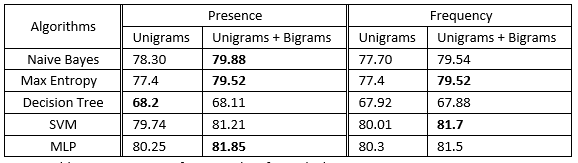

# Sentiment Anaysis on a twitter Dataset of 1.6M Tweets

This is a study to compare the accuracy of different algorithms like Naive Bayes, Decision tree, CNN, etc.  
Here I have also added a stats code which gives out data as shown below:  
 
By seeing this we get an idea on the number of tweets, user mentions, URLs, emojis, unigram and bigrams  in the dataset used.  
The final accuracy after running the various classifiers in different sparse vector representation we get the following result:  
 

You can download the dataset from the this [link](https://1drv.ms/u/s!AgeJDlHHfQB6sAoQk50IqUKOCOWr?e=hrvEmd).
